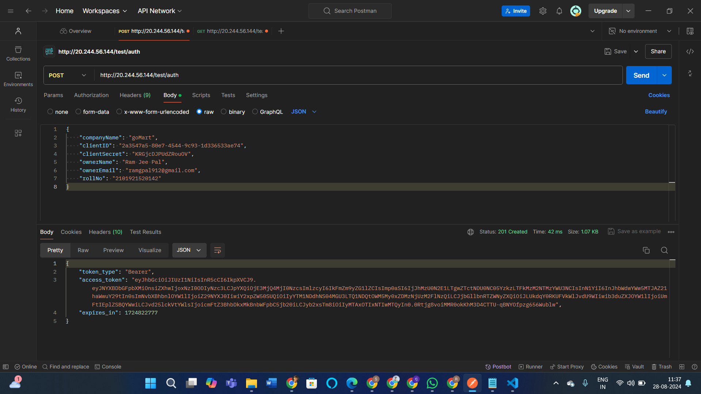
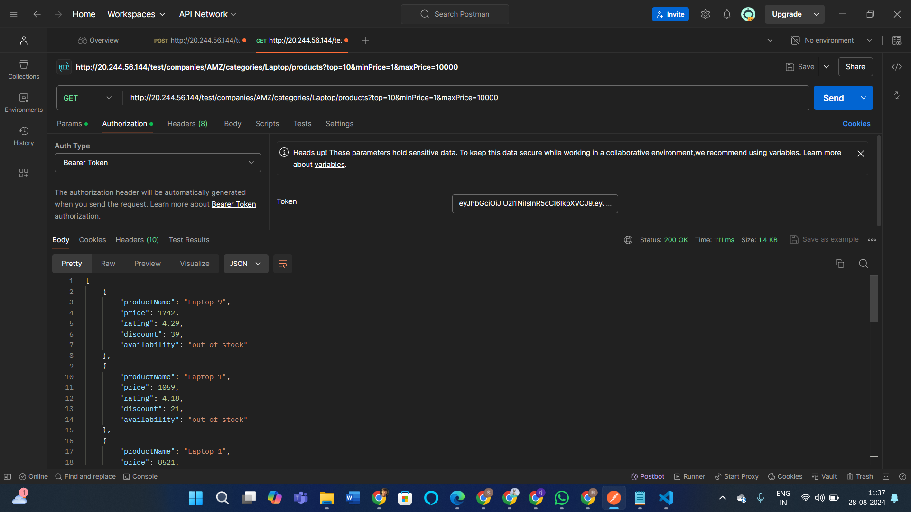
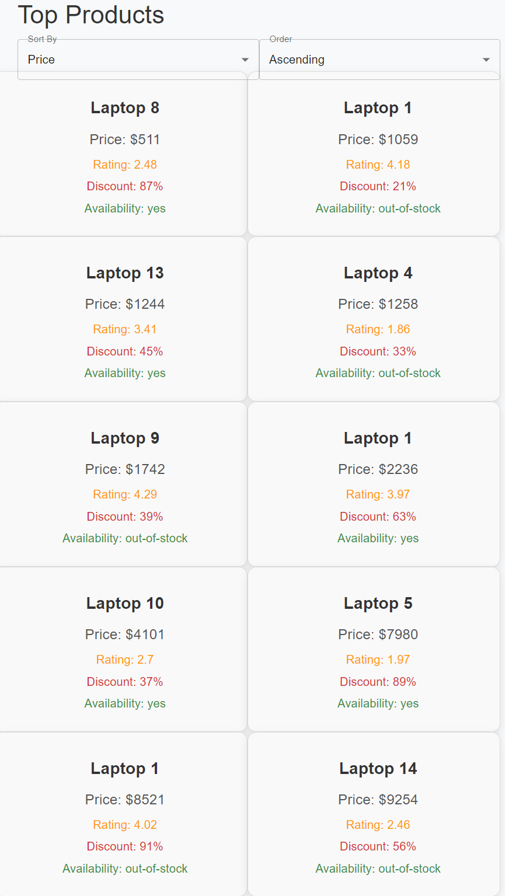

# Affordmed Assignment

## Overview

It is a React application designed for managing and displaying product information. It allows users to view a list of products, sort them based on various criteria, and view detailed information about individual products.

## Features

- **Product List**: 
  - Display a list of products with details such as name, price, rating, discount, and availability.
  - Sort products by price, rating, or discount.
  - Toggle between ascending and descending order.

- **Product Details**:
  - View detailed information about a specific product, including its name, price, rating, discount, and availability.

## Installation

To get started with the Product Management App, follow these steps:

1. **Clone the repository:**

    ```bash
    git clone <repository-url>
    cd product-management-app
    ```

2. **Install dependencies:**

    ```bash
    npm install
    ```

3. **Start the application:**

    ```bash
    npm start
    ```

   The app will be available at `http://localhost:3000` by default.

## Usage

- **Product List Page**: Navigate to the `/products` route to see the list of products. Use the dropdowns to sort the products by price, rating, or discount.

- **Product Details Page**: Navigate to `/products/:productId` to view the details of a specific product.

## Output Snapshots

### Product List


### Product Details

*Snapshot of the postman app, while authorizing:*



*Snapshot of the postman app, while accessing data:*



*Snapshot of the Product List page showing a list of products with sorting options:*



